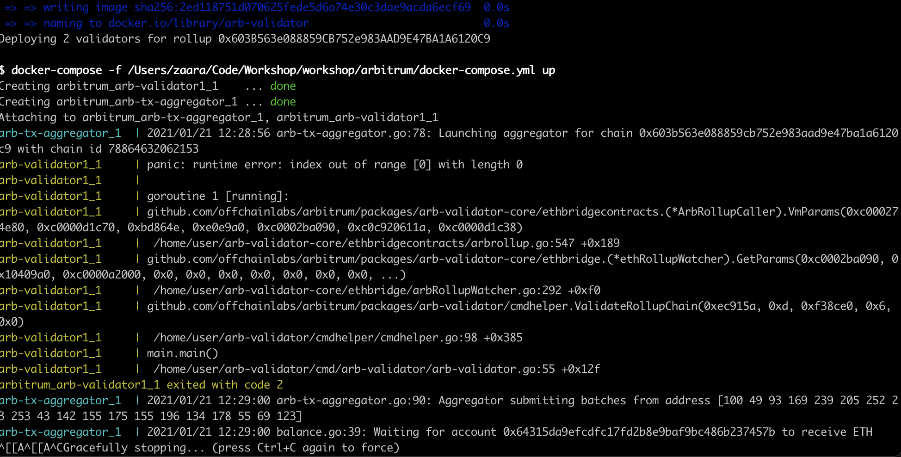
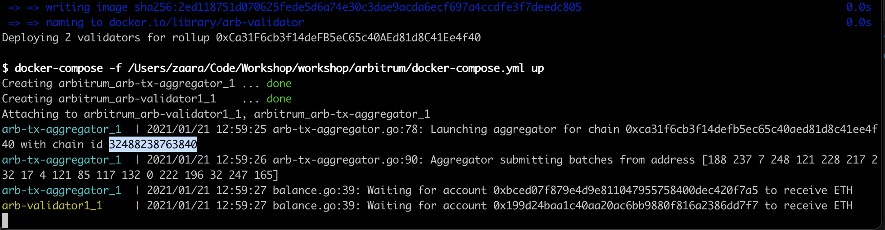
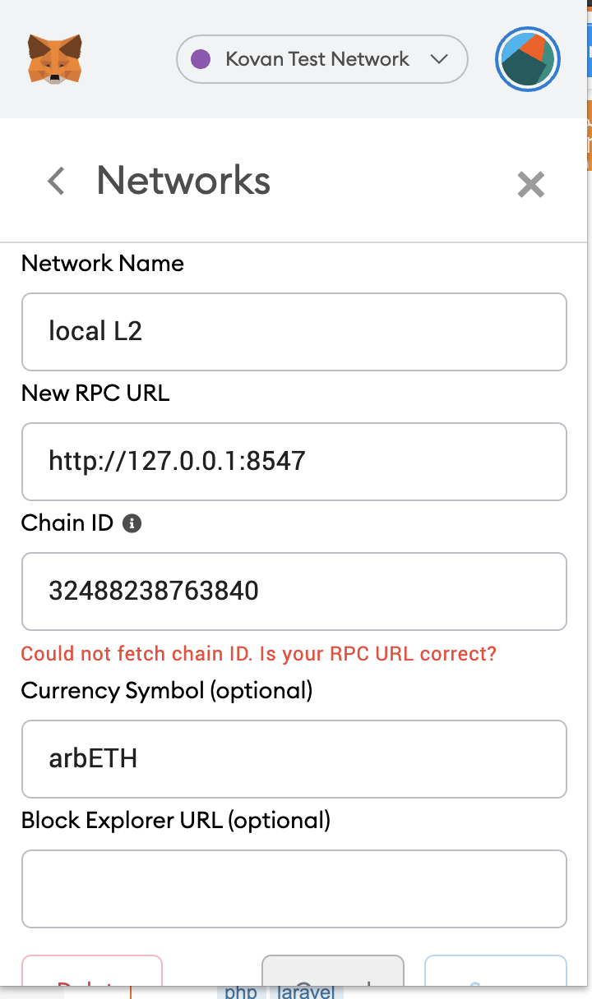

## 1- Target: Running L1 on local, Running L2 on local:

- I want to run separate L2 nodes on my local. (instead of yarn demo:initialize --validatorcount 2, I want to use yarn prod:initialize)
- The reason I am trying to run it on multiple clients, I want to observe synchronization process.

- L1 Deployment Steps:
```
yarn docker:build:geth
yarn docker:geth
```
output:
```
Connection to localhost port 7545 [tcp/nta-us] succeeded!
All contracts have already been compiled, skipping compilation.
ArbRollup deployed at 0x5DfBB3D6775B7D0e702D6c9Ccd1fCF4Ba08DA97c for 4836308
GlobalInbox deployed at 0x603B563e088859CB752e983AAD9E47BA1A6120C9 for 2536640
InboxTopChallenge deployed at 0x895521964D724c8362A36608AAf09A3D7d0A0445 for 1050326
ExecutionChallenge deployed at 0x0b55929f4095f677C9Ec1F4810C3E59CCD6D33C7 for 1948379
OneStepProof deployed at 0xCAAd408788C192979384768DD5bE04eC1b3787dA for 5009685
ChallengeFactory deployed at 0x2EEBB8EE9c377caBC476654ca4aba016ECA1B9fc for 478833
```

- L2 Deployment Steps:
```
yarn prod:initialize 0x603B563e088859CB752e983AAD9E47BA1A6120C9 http://localhost:7545
yarn deploy:validators 0x603B563e088859CB752e983AAD9E47BA1A6120C9 --password pass
```

output: (error)



## 2- Target: Running L1 on Kovan, Running L2 on local:
- I deployed smart contracts to L1 Kovan with Arbitrum Deployment tool (https://github.com/OffchainLabs/arbitrum-deployment-website/tree/master/src)
- Deployed contract address: https://kovan.etherscan.io/address/0xca31f6cb3f14defb5ec65c40aed81d8c41ee4f40#internaltx

- L2 Deployment Steps:
```
yarn prod:initialize 0xCa31F6cb3f14deFB5eC65c40AEd81d8C41Ee4f40 https://kovan.infura.io/v3/04b85e5c71a042c09a1c3684586e3288
yarn deploy:validators 0xCa31F6cb3f14deFB5eC65c40AEd81d8C41Ee4f40 --password pass
```

output:


It says chain id is: 32488238763840

But this chain id seems like incorrect on metamask:

error: Could not fetch chain ID. Is your RPC URL correct?

